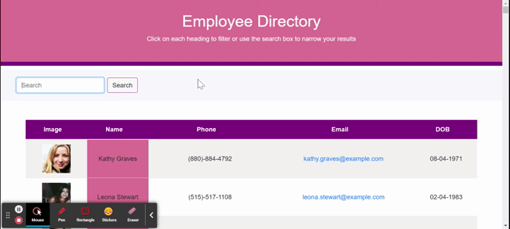

<h1 align="center">Employee Directory</h1>

  [](https://opensource.org/licenses/MIT)


## Table of Contents

  - [Description](#description)
  - [Demo](#demo)
  - [Installation](#installation)
  - [Usage](#usage)
  - [Contributors](#contributors)
  - [Tests](#tests)
  - [License](#license)
  - [Technologies](#technologies)
  - [Questions](#questions)

  
  ## Description
  This app utilizes an API to populate random users and then create a directory. Other users on the app can search for employees by "name" and also organize each field (Name, Email, DOB) in ascending or descending order.

  ## Demo

  
  

  ## Installation
 In the command-line, type 'node i' for the following npm packages:
 ``` 
 axios
  ```
 ``` 
 react
 ```
 ``` 
 react-dom
  ```

  Once all third-party packages have been successfully installed, the application is ready to use. For more details, reference the application's ```package.json``` file.

  ## Usage
  To launch the application, please visit this link to Heroku - https://intense-headland-54767.herokuapp.com/
  
  When the user loads the page, a table of random employees should render. The user will be able to sort and filter the table by the name of the employee.


  ## Contributors
  Emily B. Todt

  ## Tests
  
  No tests were included.

  ## License
  
        Copyright (c) 2021 Emily B. Todt 
        Licensed under the [MIT license](https://opensource.org/licenses/MIT).
      

  ## Technologies
  JavaScript, React, HTML, CSS

  ## Questions
  Reach me on [GitHub](https://www.github.com/todtsies)  
  Reach me via email at <emilybtodt@gmail.com>
